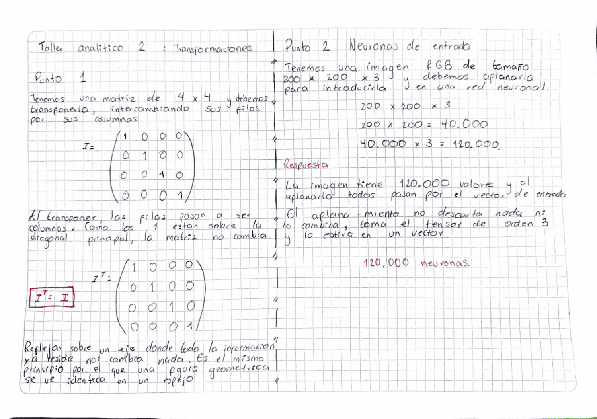

# Sesion 01 — Refuerzo Python y Algebra Lineal

## Taller Analitico 1: Indexacion y Tensores

### Respuestas

**1.Punto** 

`A[2,3] = 0`. Como el indice empieza a contar desde 0, la fila 2 seria `[255, 0, 128, 0, 255]`. Entonces la columna 3 es el segundo `0` de la fila.

Este valor esta justo al lado derecho del valor gris `128`, que esta en `A[2,2]`. El `0` representa el color negro, mientras que el `255` representa blanco. Por eso se puede ver un contraste entre estos valores y se forma parte del borde de la figura.

**2.Punto**

 Primero calculamos cuantos pixeles tiene la imagen:

`1080 × 1920 = 2,073,600 pixeles`

Como la imagen usa RGB, tiene 3 canales por cada pixel:

`2,073,600 × 3 = 6,220,800 bytes`

El tipo `uint8` ocupa 1 byte por cada valor, asi que en total son **6,220,800 bytes**.

Para pasarlo a MB dividimos entre 1,000,000:

`6,220,800 ÷ 1,000,000 = 6.2208 MB`

Y para pasarlo a MiB usamos 1 MiB = 1,048,576 bytes:

`6,220,800 ÷ 1,048,576 ≈ 5.93 MiB`

Entonces, la imagen ocupa aproximadamente **6.22 MB** o **5.93 MiB**.

## Taller de Laboratorio 1: Transformaciones Afines

Codigo: [`lab01_transformaciones_afines.py`](lab01_transformaciones_afines.py)

Use `alpha = 0.5` para reducir el contraste de la imagen y `beta = -50` para
bajar el brillo en 50 unidades.

Primero se hace el calculo usando `float32` y despues se usa `np.clip()` para
mantener los valores entre 0 y 255 antes de convertirlos a `uint8`. Esto es
importante porque si un valor negativo se convierte directamente a `uint8`,
puede terminar convirtiendose en un valor muy alto.

~~~
Amplitud original:  51
Amplitud procesada: 26
~~~

La amplitud procesada queda aproximadamente en la mitad de la original, que es
lo esperado porque usamos `alpha = 0.5`. El `beta` afecta principalmente el
brillo, mientras que `alpha` es el que cambia el contraste.

## Taller Analitico 2: Transformaciones

### Respuestas

**1.Punto**

Tenemos una matriz identidad de 4x4 y tenemos que transponerla, es decir,
intercambiar las filas por las columnas.

En este caso la matriz no cambia porque los `1` estan en la diagonal principal
y los demas valores son `0`.

`I^T = I`

Por eso, aunque hagamos la transpuesta, la matriz queda exactamente igual.

**2.Punto**

Tenemos una imagen RGB de tamaño `200 x 200 x 3` y necesitamos convertirla en
un solo vector para poder usarla como entrada de una red neuronal.

Primero calculamos la cantidad de pixeles:

`200 × 200 = 40,000 pixeles`

Como cada pixel tiene 3 canales RGB:

`40,000 × 3 = 120,000 valores`

Al aplanar la imagen no se elimina ningun dato, simplemente se pasa de tener
una matriz de 3 dimensiones a tener un solo vector.

Por eso, la capa de entrada de la red neuronal necesita 120,000 neuronas,
una por cada valor de la imagen.

## Taller de Laboratorio Final: Programando un Kernel

Codigo: [`lab02_kernel_convolucion.py`](lab02_kernel_convolucion.py)

Multiplique la seccion de imagen por el kernel usando el producto Hadamard
(operador `*`) y luego sume todos los valores con `np.sum()`. El resultado es
el valor que la convolucion escribe en la posicion central.

~~~
Pixel central original:   200
Pixel central resultante: 600
~~~

El pixel paso de 200 a 600 porque el kernel resta los cuatro vecinos y
multiplica el centro por 5. Como el centro ya era mas brillante que su entorno,
esa diferencia se amplifica.

Los coeficientes del kernel suman 1 (5 - 4), asi que en una zona donde todos los
valores son iguales el resultado no cambia. El filtro solo actua donde hay
contraste, y ese es el principio con el que una CNN detecta bordes y texturas.
