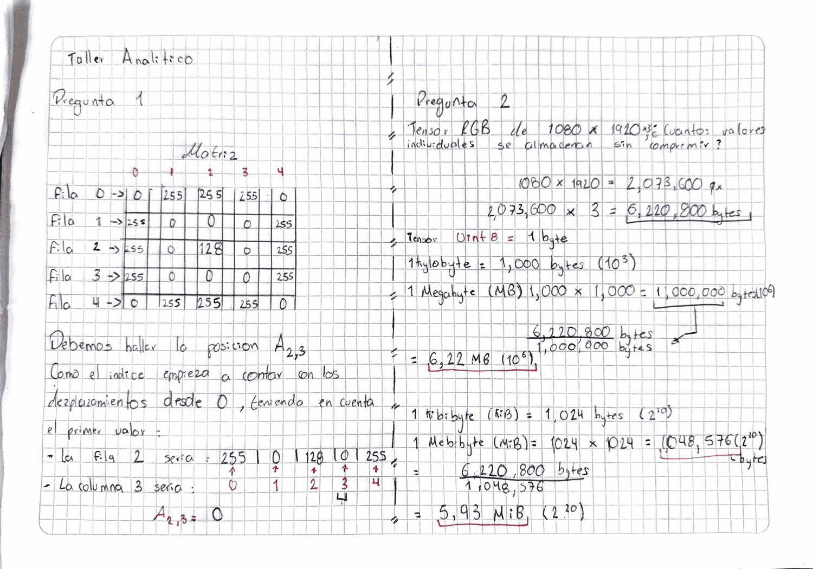

# Sesion 01 — Refuerzo Python y Algebra Lineal

## Taller Analitico 1: Indexacion y Tensores

### Respuestas

**1.Punto** 

`A[2,3] = 0`. Como el indice empieza a contar desde 0, la fila 2 seria `[255, 0, 128, 0, 255]`. Entonces la columna 3 es el segundo `0` de la fila.

Este valor esta justo al lado derecho del valor gris `128`, que esta en `A[2,2]`. El `0` representa el color negro, mientras que el `255` representa blanco. Por eso se puede ver un contraste entre estos valores y se forma parte del borde de la figura.

**2.Punto**

 Primero calculamos cuantos pixeles tiene la imagen:

`1080 × 1920 = 2,073,600 pixeles`

Como la imagen usa RGB, tiene 3 canales por cada pixel:

`2,073,600 × 3 = 6,220,800 bytes`

El tipo `uint8` ocupa 1 byte por cada valor, asi que en total son **6,220,800 bytes**.

Para pasarlo a MB dividimos entre 1,000,000:

`6,220,800 ÷ 1,000,000 = 6.2208 MB`

Y para pasarlo a MiB usamos 1 MiB = 1,048,576 bytes:

`6,220,800 ÷ 1,048,576 ≈ 5.93 MiB`

Entonces, la imagen ocupa aproximadamente **6.22 MB** o **5.93 MiB**.
