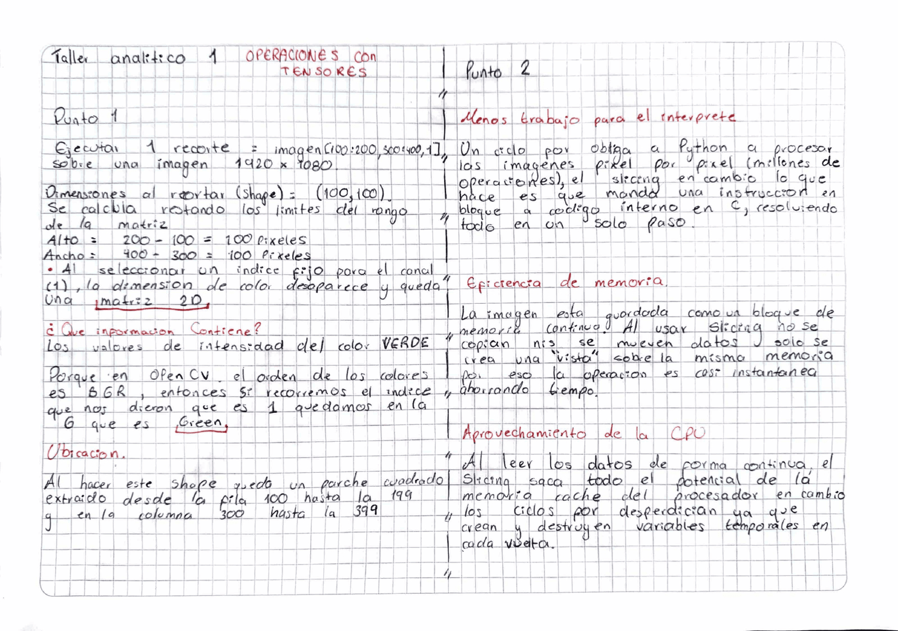

# Sesión 02 — Tensor de Color y Análisis Estadístico

Tensores RGB, slicing por canal, conversión a escala de grises e histogramas.

## Taller Analítico 1 — Operaciones con tensores

### Punto 1

`recorte = imagen[100:200, 300:400, 1]` sobre una imagen de 1920×1080.

El shape resultante es **(100, 100)**. Las dimensiones salen de restar los
límites de cada rango: 200 − 100 = 100 filas y 400 − 300 = 100 columnas. El
tercer índice es fijo y no un rango, así que la dimensión de color desaparece
y queda una matriz 2D.

El recorte contiene las intensidades del canal **verde**, porque OpenCV carga
los canales en orden BGR y el índice 1 cae en la G. Espacialmente es un parche
cuadrado que va de la fila 100 a la 199 y de la columna 300 a la 399.

### Punto 2

¿Por qué aislar un canal con slicing le gana a dos `for` anidados?

**Menos trabajo para el intérprete.** Un ciclo `for` obliga a Python a procesar
la imagen píxel por píxel, millones de operaciones. El slicing manda una sola
instrucción en bloque a código interno en C y resuelve todo en un paso.

**Eficiencia de memoria.** La imagen está guardada como un bloque de memoria
continuo. Al usar slicing no se copian ni se mueven datos: solo se crea una
vista sobre esa misma memoria, por eso la operación es casi instantánea.

**Aprovechamiento de la CPU.** Al leer los datos de forma continua, el slicing
saca todo el potencial de la memoria caché del procesador. Los ciclos `for` la
desperdician porque crean y destruyen variables temporales en cada vuelta.
