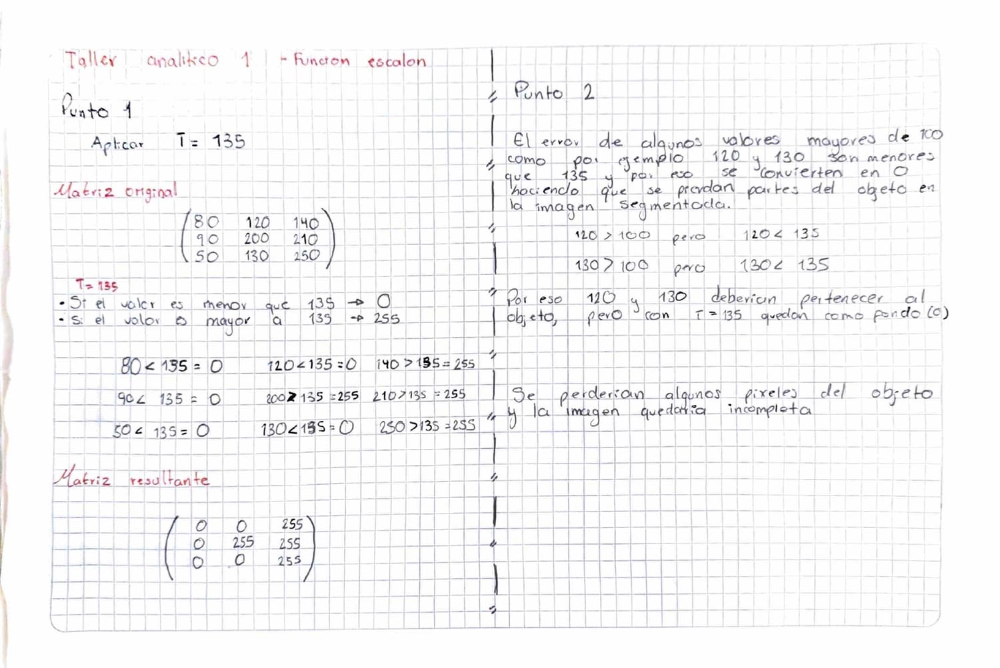
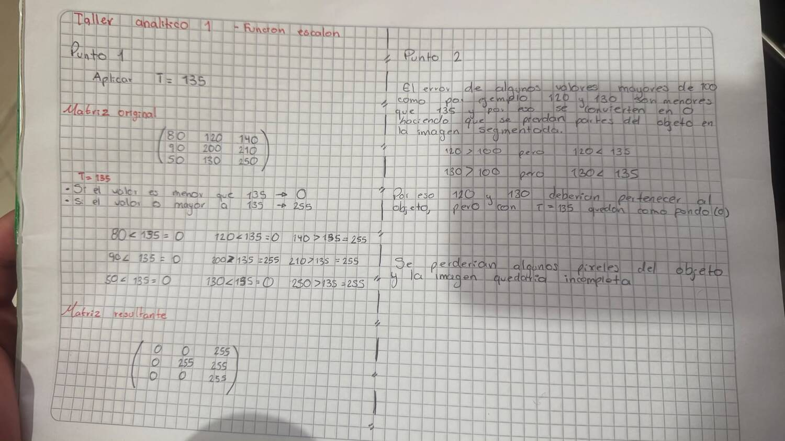
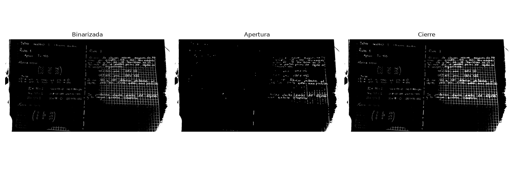

# Sesion 03 — Segmentacion

Umbralizacion binaria, elemento estructurante y limpieza de ruido con
morfologia matematica.

## Taller Analitico 1 — Funcion escalon



### Punto 1

Umbralizacion binaria con T = 135 sobre la sub-matriz de 3x3. El criterio es
puntual: cada pixel se compara solo contra el umbral, sin mirar a sus vecinos.
Si el valor es mayor o igual a 135 pasa a 255, y si es menor pasa a 0.

Matriz original:

```
 80  120  140
 90  200  210
 50  130  250
```

Matriz resultante:

```
   0    0  255
   0  255  255
   0    0  255
```

Los unicos que pasaron el umbral fueron 140, 200, 210 y 250. Uso 255 y no 1
porque en uint8 el blanco se representa con 255.

### Punto 2

El objetivo era aislar todos los valores mayores a 100, pero el umbral quedo
en 135. Ahi esta el error: el 120 y el 130 son mayores a 100, asi que debian
pertenecer al objeto, pero como son menores que 135 terminaron en 0 y se
fueron al fondo. Con el criterio de mayor o igual, el umbral correcto era
T = 101.

De seis pixeles que debian ser objeto solo sobrevivieron cuatro, o sea que se
perdio un tercio. Visualmente eso no es solo una imagen incompleta: los
valores intermedios estan casi siempre en los bordes y en las zonas mal
iluminadas, asi que el objeto queda con huecos negros adentro y con los
contornos adelgazados. Es exactamente el tipo de dano que despues toca
reparar con una operacion de cierre.

## Taller de Laboratorio Final — Limpiando la vision

`lab05_segmentacion_morfologia.py`





La imagen es una foto de mi propio taller analitico, tomada con luz lateral
para que la iluminacion quedara despareja a proposito. Binarizo con un umbral
estatico de 127 y no con Otsu, porque Otsu calcularia el umbral optimo y me
dejaria sin ruido que limpiar, que es justo lo que el taller pide practicar.

Uso `THRESH_BINARY_INV` porque mi objeto de interes es el texto, que es
oscuro. Las funciones `erode` y `dilate` de OpenCV trabajan sobre los pixeles
blancos, asi que el texto tiene que quedar en 255 y el papel en 0. Si no
invirtiera, estaria limpiando el papel en lugar del texto.

El elemento estructurante es una matriz de 3x3 llena de unos. Escribi la
apertura como una erosion seguida de una dilatacion, y el cierre al reves, en
vez de usar `cv2.morphologyEx` con `MORPH_OPEN` y `MORPH_CLOSE`. El resultado
es identico y esa version es mas corta, pero separar las dos operaciones deja
ver de que esta compuesta cada una.

### Conteo de pixeles blancos

| Resultado | Pixeles blancos | Cambio |
|---|---|---|
| Binarizada | 128332 | — |
| Apertura | 86888 | -41444 (-32%) |
| Cierre | 136841 | +8509 (+6.6%) |

### Conclusion

Para esta imagen la operacion mas efectiva fue el **cierre**.

La apertura limpio bien el fondo pero se llevo casi toda la escritura: en el
panel se ve que el lado izquierdo quedo practicamente vacio. La razon es el
grosor del objeto. Mi letra tiene un trazo de pocos pixeles de ancho, y la
erosion con un kernel de 3x3 le quita una capa por cada lado, asi que el trazo
desaparece por completo. La dilatacion que viene despues ya no puede
recuperarlo, porque no se puede dilatar algo que dejo de existir.

El cierre invierte el orden y por eso nunca pone el trazo en riesgo. Dilata
primero, lo que rellena los huecos internos de las letras y vuelve a unir los
trazos que la sombra habia cortado, y despues erosiona para devolver el
tamano. El texto se ve mas solido que en la binarizada y el costo es que el
ruido del fondo tambien engordo un poco.

El conteo respalda la lectura visual. La apertura elimino el 32% de los
pixeles blancos, una cifra demasiado alta para ser solo ruido: si el ruido
fuera un tercio de la imagen, el texto no se alcanzaria a leer en la
binarizada. Que se lea significa que lo que la apertura borro era objeto.

Esto no quiere decir que la apertura no sirva. Sobre formas macizas, como una
celula o una matricula, la erosion le quita una capa a algo que tiene decenas
de pixeles de grosor y el objeto ni se entera. Lo que fallo aca no fue la
operacion sino la relacion entre el tamano del kernel y el grosor del objeto.