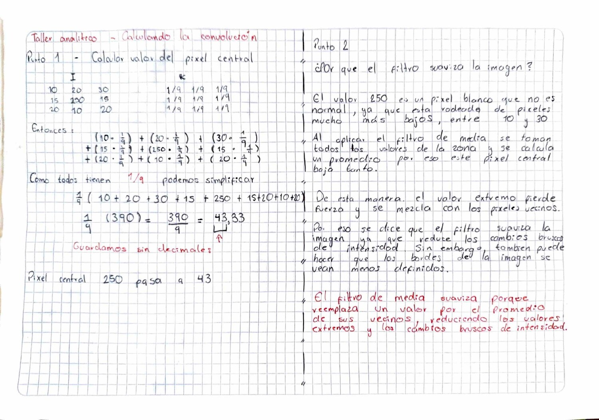
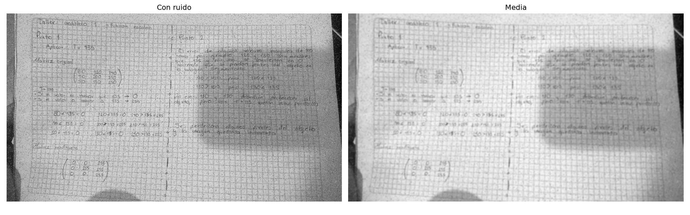
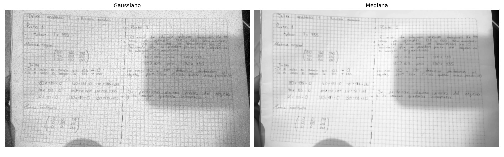

# Sesion 04 — Convolucion y Filtrado

Convolucion 2D, filtro de media y comparacion de tres estrategias de suavizado
frente al ruido de sal y pimienta.

## Taller Analitico — Calculando la convolucion



### Punto 1

Seccion de imagen de 3x3 y kernel de media, donde los nueve pesos valen 1/9:

```
Imagen (I)              Kernel (K)
 10   20   30           1/9  1/9  1/9
 15  250   15           1/9  1/9  1/9
 20   10   20           1/9  1/9  1/9
```

La operacion es un producto elemento por elemento seguido de una sumatoria. No
es `np.dot`, porque eso seria producto matricial y aca necesito multiplicar
posicion contra posicion.

Como los nueve pesos son iguales, puedo factorizar el 1/9 y sumar primero:

```
(1/9) * (10 + 20 + 30 + 15 + 250 + 15 + 20 + 10 + 20) = 390 / 9 = 43.33
```

El pixel central pasa de 250 a 43. El resultado real es 43.33, pero uint8 no
guarda decimales.

Los coeficientes del kernel suman 1, porque 9 por 1/9 da 1. Eso preserva el
brillo global: una zona plana de valor 100 sigue valiendo 100 despues del
filtro. Es la misma razon por la que el kernel de realce de la sesion 01
tambien sumaba 1.

### Punto 2

El 250 era ruido de sal, un pixel blanco anomalo rodeado de vecinos entre 10 y
30. Quedo en 43, o sea casi eliminado.

Pero el filtro no lo borro, lo repartio. Cuando el kernel se desplace y quede
centrado sobre el 10 de la esquina, el 250 va a seguir estando bajo la ventana
y va a entrar de nuevo en el promedio, levantando ese pixel de fondo. Por eso
el ruido no desaparece sino que se convierte en una mancha gris difusa
alrededor del punto original.

Ahi esta el suavizado: el filtro de media no distingue entre un borde legitimo
y un pixel corrupto, porque le da el mismo peso a los nueve vecinos. Un borde
tambien es un cambio brusco de intensidad, asi que lo difumina igual.

## Taller de Laboratorio — Estrategias de suavizado

`lab06_filtros_suavizado.py`





Genero el ruido de sal y pimienta en vez de descargar una imagen ruidosa.
Sorteo coordenadas al azar con `default_rng()`, pongo la mitad en 0 y la otra
mitad en 255, que es exactamente lo que es el ruido de impulso: pixeles en los
extremos del rango, sin relacion con su vecindad. Asi controlo la proporcion
exacta de ruido, que dejo en 5%. Uso una semilla fija para que el experimento
sea reproducible.

El `.copy()` no es opcional. Sin el, la variable ruidosa seria una vista sobre
el mismo bloque de memoria y estaria dañando la imagen original, que despues
necesito como referencia limpia.

Aplico los tres filtros con kernel de 7x7 como pide el taller. Con un kernel de
3x3 los tres se verian parecidos; con uno agresivo la diferencia entre media y
mediana salta a la vista.

### Error medio contra la imagen original

| Version | Error medio |
|---|---|
| Con ruido | 6.20 |
| Media | 9.33 |
| Gaussiano | 7.87 |
| Mediana | 6.34 |

Calculo la diferencia en int16 y no en uint8, porque restar dos uint8 con
resultado negativo da la vuelta por aritmetica modular y 10 menos 20 daria 246
en vez de -10.

### Analisis critico

Lo primero que salta es que los tres filtros empeoraron la metrica: ninguno
bajo de 6.20. Eso no significa que no sirvan, significa que el error medio es
una metrica pobre para este caso. El ruido afecta al 5% de los pixeles, pero un
kernel de 7x7 toca el 100% de la imagen. Corrijo un error grande en pocos
pixeles a cambio de introducir uno pequeño en todos, y en una foto de texto con
detalle fino el segundo pesa mas.

Lo que si es significativo es el orden. La media es la peor con 9.33, el
gaussiano queda en medio con 7.87 y la mediana es la mejor con 6.34,
practicamente empatada con la imagen ruidosa.

La razon es algoritmica. La media y el gaussiano son convoluciones lineales:
multiplican por pesos y suman, asi que un valor de 0 o de 255 entra en la cuenta
y arrastra el promedio. Por eso queda una mancha gris alrededor de cada punto de
ruido, que es el mismo efecto que calcule a mano en el taller analitico.

La mediana no es una convolucion. Ordena los 49 valores bajo el kernel y escoge
el del medio. Un 0 o un 255 aislado queda en una punta de la lista ordenada y
nunca es el valor central, asi que simplemente se descarta. Ademas devuelve un
valor que ya existia en la vecindad en vez de un promedio inventado, asi que en
las zonas limpias devuelve el pixel original y no aporta error.

El gaussiano queda en medio porque sus pesos no son iguales: el pixel central
pesa mas que los lejanos, asi que un vecino a tres posiciones casi no influye y
el resultado se aleja menos del valor original. Suaviza el ruido pero preserva
mejor las estructuras que la media.

Para ruido de impulso la mediana es la respuesta correcta. Para ruido gaussiano,
que afecta a todos los pixeles con variaciones pequeñas en vez de a unos pocos
con valores extremos, el filtro gaussiano seria la mejor opcion.