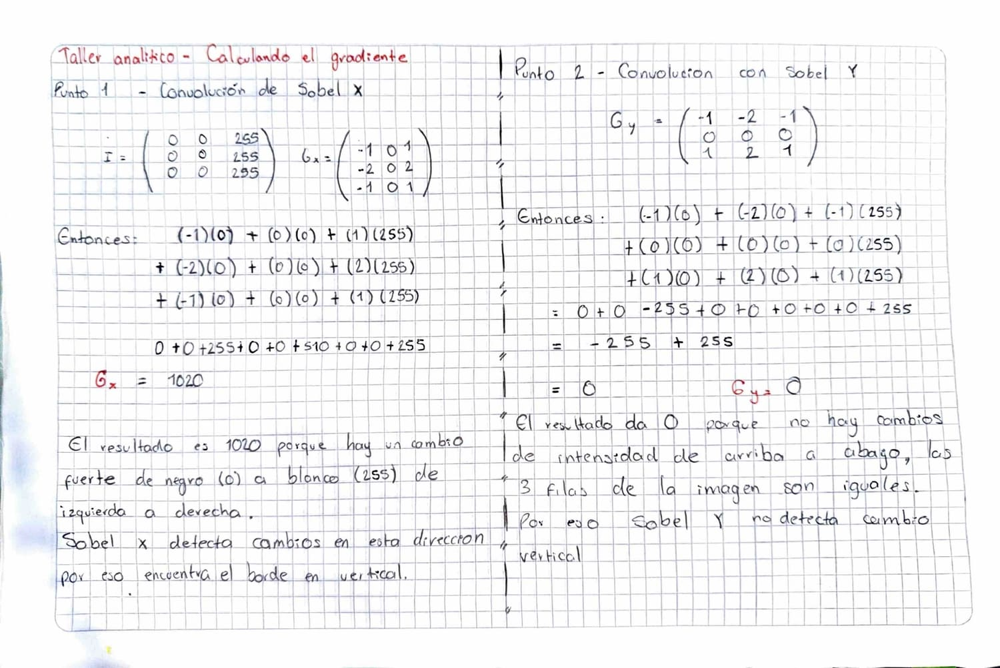
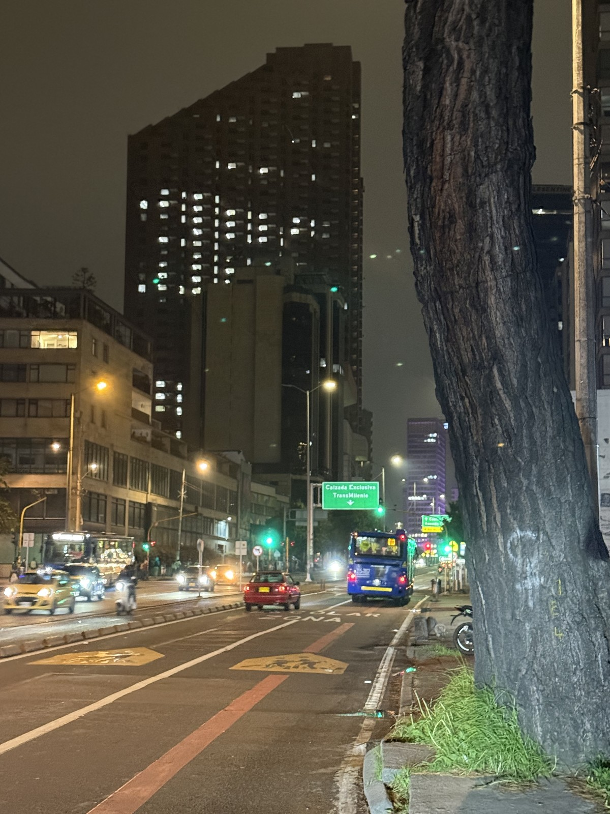
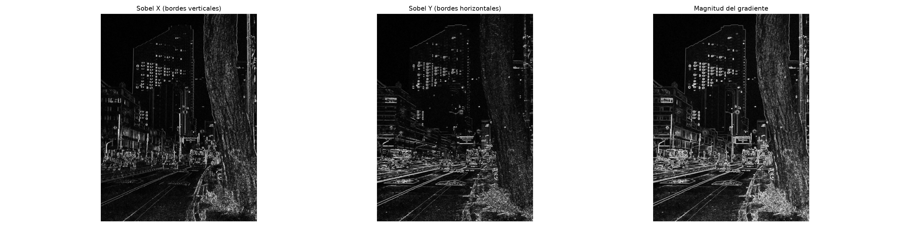
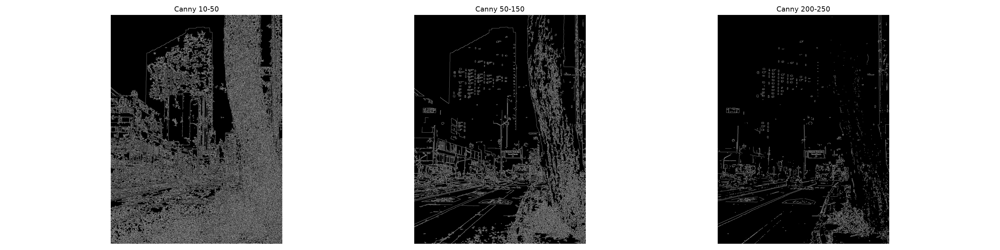

# Sesion 05 — Gradientes espaciales y deteccion de bordes

Derivadas discretas con los operadores de Sobel, magnitud del gradiente y el
algoritmo de Canny.

## Taller Analitico — Calculando el gradiente



Matriz de imagen con un borde vertical perfecto: mitad izquierda negra, mitad
derecha blanca.

```
Imagen (I)          Sobel X (Gx)        Sobel Y (Gy)
 0   0  255          -1   0   1          -1  -2  -1
 0   0  255          -2   0   2           0   0   0
 0   0  255          -1   0   1           1   2   1
```

### Punto 1

```
(-1)(0) + (0)(0) + (1)(255) =  255
(-2)(0) + (0)(0) + (2)(255) =  510
(-1)(0) + (0)(0) + (1)(255) =  255
                              ----
                        Gx =  1020
```

El gradiente en X da 1020 porque hay un cambio fuerte de negro a blanco de
izquierda a derecha, y Sobel X mide exactamente eso.

Dos cosas que vale la pena notar. La columna del medio del kernel tiene los tres
pesos en 0, asi que el pixel central ni siquiera entra en el calculo: el
operador no pregunta cuanto vale el pixel sino que tan distinto es lo que tiene
a la derecha de lo que tiene a la izquierda, que es una derivada. Y 1020 es
4 por 255, el maximo que puede dar este kernel, lo cual tiene sentido porque le
pase un borde perfecto.

### Punto 2

```
(-1)(0) + (-2)(0) + (-1)(255) = -255
 (0)(0) +  (0)(0) +  (0)(255) =    0
 (1)(0) +  (2)(0) +  (1)(255) =  255
                                ----
                          Gy =     0
```

Da cero porque Sobel Y mide el cambio de arriba hacia abajo, y las tres filas de
la imagen son identicas. Bajando por cualquier columna el valor nunca cambia, asi
que el -255 de la fila de arriba se cancela exacto con el +255 de la de abajo.

Eso indica que el borde es vertical. El gradiente apunta perpendicular al borde,
no a lo largo de el: como Gy es 0 y Gx es 1020, el vector gradiente es puramente
horizontal, y la linea que lo produce es la perpendicular a ese vector.

Con la formula de la magnitud:

```
G = sqrt(Gx^2 + Gy^2) = sqrt(1020^2 + 0^2) = 1020
```

El borde tiene fuerza maxima y toda esa fuerza esta en el eje X.

## Taller de Laboratorio — Inspector de bordes

`lab07_deteccion_bordes.py`







La foto es una calle de Bogota de noche, tomada por mi. Tiene geometria clara en
los edificios, los postes y las lineas de la calzada, y textura compleja en la
corteza del arbol y el cielo. Al ser nocturna tambien trae ruido de sensor en las
zonas oscuras, que resulto util para comparar Sobel contra Canny.

Uso `cv2.CV_64F` y no uint8 en las dos llamadas a Sobel. La derivada se sale del
rango por los dos lados: en el taller analitico Gx dio 1020, que no cabe en 255,
y un borde que va de claro a oscuro da negativo, que en uint8 se truncaria a 0 y
desapareceria. Calculo en punto flotante y convierto al final con
`convertScaleAbs`, que toma el valor absoluto y lleva a uint8. El absoluto
importa porque a la hora de mostrar un borde de -800 es tan borde como uno de
+800; el signo solo dice en que direccion va la transicion.

### Separacion de orientaciones

En el panel de Sobel se ve la diferencia entre los dos operadores. Sobel X marca
el tronco del arbol con sus surcos verticales, los postes y las lineas de la
calzada. En Sobel Y el tronco casi desaparece, porque sus surcos son verticales
y no hay cambio de arriba hacia abajo, y en cambio saltan las cornisas de los
edificios y las franjas horizontales de la fachada de la izquierda. Es el mismo
fenomeno del Gy = 0 del taller analitico, pero en una foto real.

La magnitud del gradiente recupera todo, porque combina las dos componentes con
el teorema de Pitagoras. Las lineas de la via, que van en diagonal, aparecen en
los dos operadores por separado: una diagonal tiene componente horizontal y
vertical al mismo tiempo.

### Experimentacion con los umbrales de Canny

| Umbrales | Pixeles marcados como borde |
|---|---|
| 10 - 50 | 22.93% |
| 50 - 150 | 10.32% |
| 200 - 250 | 3.20% |

Con 10-50 casi una cuarta parte de la imagen queda marcada como borde. El cielo
nocturno se llena de puntos que son ruido de sensor, no estructura, y la imagen
queda ilegible.

Con 200-250 solo sobrevive el 3.20%. Se pierden las siluetas de los edificios
contra el cielo y buena parte del arbol: son bordes reales, pero de bajo
contraste, y el umbral alto los descarta.

Con 50-150 el cielo queda limpio, los edificios se leen y la calzada conserva su
forma. Para esta imagen es el mejor balance, porque queda por encima del ruido
del cielo y por debajo del contraste de los bordes arquitectonicos.

La conclusion es que no existe un umbral optimo universal: depende del contraste
de la imagen. En una foto nocturna, con rango dinamico bajo y ruido de sensor,
bajar mucho el umbral inferior deja pasar el ruido y subirlo mucho elimina
estructura real.

### Por que Canny se ve mejor que Sobel

Canny no es otro operador sino un algoritmo de cuatro etapas. Primero suaviza con
un filtro gaussiano, que es justo lo que trabaje en la sesion anterior, y ese
paso va primero por una razon concreta: derivar amplifica el ruido, porque un
pixel corrupto es un cambio brusco de intensidad y la derivada mide exactamente
eso. Despues calcula los gradientes con operadores tipo Sobel, adelgaza los
bordes a un pixel de grosor con supresion de no maximos, y al final filtra con
histeresis.

La histeresis es la razon de los dos umbrales. Un pixel por encima del umbral
alto es borde seguro. Uno por debajo del bajo se descarta. Los que quedan en el
medio solo sobreviven si estan conectados a un borde seguro, lo que evita que una
linea real se parta en pedazos por variaciones pequeñas de intensidad.