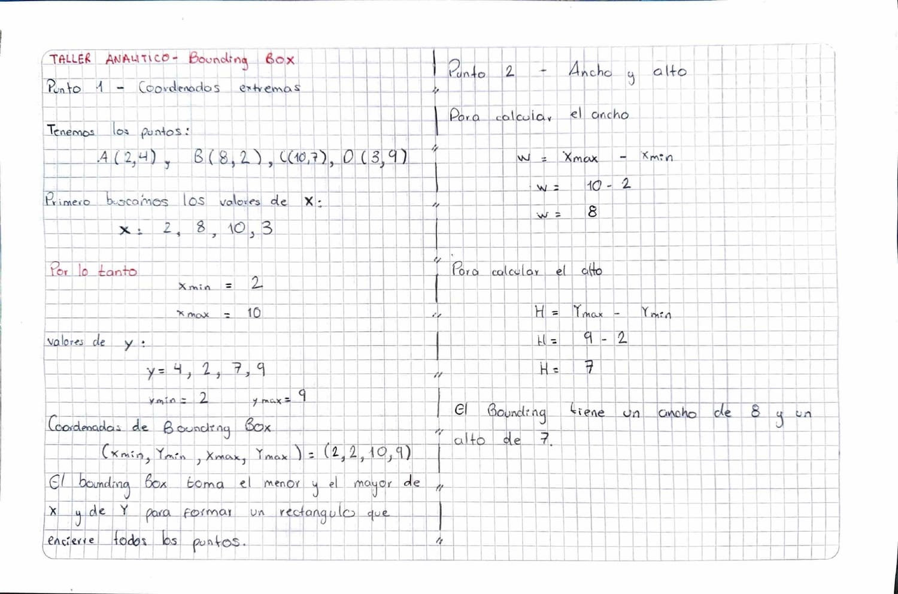
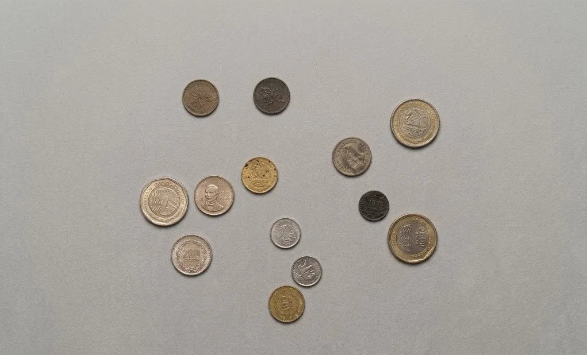
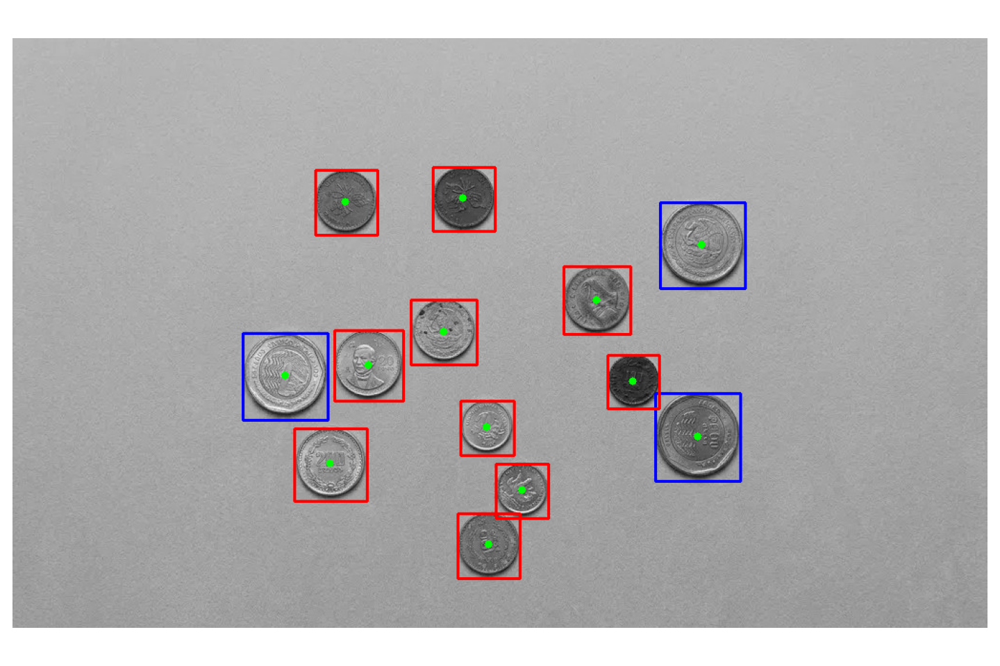

# Sesion 06 — Extraccion de caracteristicas y contornos

Analisis topologico, bounding box, momentos espaciales y clasificacion de
objetos por area. Proyecto integrador del modulo 1.

## Taller Analitico — Bounding Box



Contorno con cuatro coordenadas: A(2,4), B(8,2), C(10,7), D(3,9).

### Punto 1

El bounding box no rotado se define con cuatro numeros, y para hallarlos no hace
falta geometria: se separan las coordenadas por eje y se buscan los extremos.

```
Valores de X:  2, 8, 10, 3   ->  X_min = 2,  X_max = 10
Valores de Y:  4, 2,  7, 9   ->  Y_min = 2,  Y_max = 9
```

El box queda definido por (2, 2, 10, 9).

Lo interesante es que ningun vertice del box coincide con un vertice del objeto.
La esquina inferior izquierda es (2, 2), y ese punto no es A ni B: el 2 de X
viene de A y el 2 de Y viene de B. El rectangulo se arma mezclando coordenadas
de puntos distintos, y por eso es el mas pequeño que encierra todo.

### Punto 2

```
W = X_max - X_min = 10 - 2 = 8
H = Y_max - Y_min =  9 - 2 = 7
```

El bounding box mide 8 de ancho por 7 de alto.

Vale aclarar que `cv2.boundingRect` devolveria 9 y 8 en lugar de 8 y 7. La resta
pura da la distancia geometrica entre los extremos, pero en una imagen las
coordenadas son indices de pixeles, y si un objeto ocupa de la columna 2 a la 10
son once pixeles contados de forma inclusiva. El enunciado es geometrico, asi que
la respuesta es 8 y 7.

## Taller de Laboratorio — Clasificador de formas

`lab08_clasificador_formas.py`





La imagen son trece monedas de distintas denominaciones sobre un fondo liso,
separadas entre si para que cada una produzca su propio contorno. Si dos se
tocaran, `findContours` las devolveria como un solo objeto.

El laboratorio encadena todo el pipeline de las sesiones anteriores: conversion a
grises, umbralizacion, limpieza morfologica y deteccion de contornos.

### El problema del umbral

La parte mas util del ejercicio fue que la umbralizacion no funciono a la
primera. Probe tres estrategias.

**Otsu.** Era la opcion logica porque el fondo es uniforme, y en la sesion 03 lo
habia descartado a proposito para tener ruido que limpiar. Aca detecto solo 9 de
13 monedas y marco tres objetos falsos con forma de medialuna. Midiendo la imagen
encontre por que:

```
umbral de Otsu:  132
fondo promedio:  180
rango completo:  3 - 251
```

Otsu asume un histograma con dos poblaciones, pero aca hay tres: fondo claro,
monedas plateadas casi igual de claras y monedas oscuras. Partio en el lugar
equivocado. Las monedas plateadas quedaron por encima de 132 y se descartaron
como si fueran fondo; lo unico que bajaba del umbral eran las monedas oscuras y
las sombras de los bordes. De ahi las medialunas: los boxes median 71x26 y 69x24,
proporciones imposibles para un objeto redondo.

**Umbral fijo en 160.** Subirlo metio a las monedas claras del lado del objeto y
detecto las trece, pero el conteo se fue a 27. El fondo no es perfectamente
uniforme: tiene un degradado y la zona inferior es mas oscura, asi que esa franja
cayo por debajo de 160 y se binarizo como objeto.

**Umbral adaptativo.** Ningun valor global funciona cuando el fondo tiene un
degradado: 132 pierde monedas y 160 recoge fondo. `adaptiveThreshold` calcula un
umbral distinto para cada region, tomando la media gaussiana de una vecindad de
51x51 y restandole 10. Si la region es clara el umbral sube y si es oscura baja,
asi que el degradado se cancela solo. Con eso el conteo dio 13 de 13 y ningun
falso positivo.

El bloque tiene que ser mas grande que el objeto a detectar, por eso 51: las
monedas miden entre 54 y 90 pixeles de ancho.

Tambien cambie la apertura por un cierre. El umbral adaptativo detecta bien los
bordes pero deja huecos en el interior de objetos grandes y uniformes, porque el
centro de una moneda se parece demasiado a su propia vecindad. El cierre rellena
esos huecos sin adelgazar el objeto.

### Objetos detectados

| Objeto | Area (px) | Bounding box | Clase |
|---|---|---|---|
| 6 | 2266 | 54x56 | pequeño |
| 2 | 2374 | 55x57 | pequeño |
| 4 | 2405 | 56x57 | pequeño |
| 13 | 3323 | 65x67 | pequeño |
| 12 | 3348 | 65x68 | pequeño |
| 1 | 3380 | 65x68 | pequeño |
| 9 | 3394 | 69x68 | pequeño |
| 10 | 3822 | 70x71 | pequeño |
| 8 | 4103 | 72x74 | pequeño |
| 3 | 4336 | 76x76 | pequeño |
| 11 | 6161 | 89x90 | grande |
| 7 | 6202 | 89x91 | grande |
| 5 | 6273 | 89x92 | grande |

### Logica de clasificacion

El taller pide dibujar un box azul si el area supera cierto valor y rojo si no.
Ese valor no lo elegi a ojo sino mirando como se distribuyen las areas reales.

Ordenadas, las trece se agrupan en tres racimos: tres monedas cerca de 2300, siete
entre 3300 y 4300, y tres cerca de 6200. Entre 2405 y 3323 hay un salto de 918
pixeles, y entre 4336 y 6161 uno de 1825. Dentro de cada racimo las diferencias
son de decenas.

Puse el corte en 5000, que cae en el medio del salto mas ancho. Quedan tres boxes
azules y diez rojos, y las tres grandes son las monedas bimetalicas de mil, que a
simple vista son las mayores de la foto.

La geometria confirma lo que dice el area: las tres grandes tienen boxes de 89x90
y las demas no pasan de 76x76.

### De pixeles a caracteristicas

Todos los boxes son casi cuadrados: 65x67, 89x90, 55x57. Esa relacion de aspecto
cercana a 1 es lo que caracteriza a un circulo. Si en la imagen hubiera una llave
o un destornillador, su box seria alargado y la relacion de aspecto lo delataria
sin necesidad de mirar la foto.

Ahi esta el salto que le da nombre a la sesion. La imagen deja de ser una matriz
de pixeles y se convierte en una tabla de numeros: area, ancho, alto, centroide.
Un clasificador clasico no necesita la foto, le basta con esa tabla.

El centroide sale de los momentos espaciales. `m00` es el area, `m10` y `m01` son
las sumas ponderadas de las coordenadas, asi que dividirlas da el promedio, es
decir el centro de masa. Uso `RETR_EXTERNAL` para que OpenCV devuelva solo los
contornos externos: las monedas tienen relieve, y sin eso cada detalle interno que
quedara blanco apareceria como un objeto aparte.