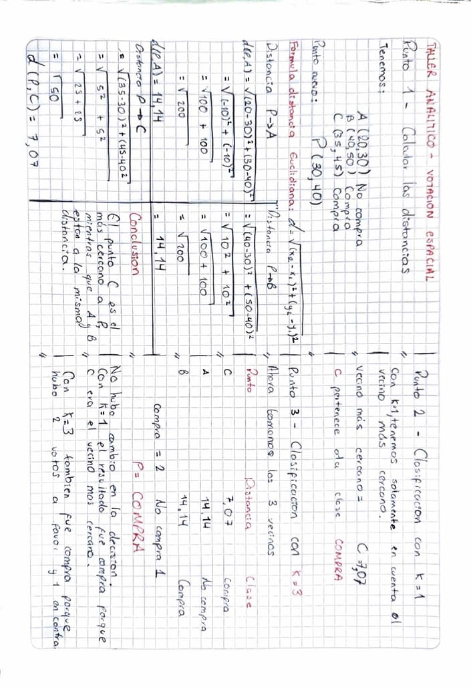

# Sesion 09 — KNN, algoritmo de los K vecinos mas cercanos

Distancia euclidiana, votacion por mayoria, efecto del hiperparametro K y la
maldicion de la dimensionalidad.

## Taller Analitico — La votacion espacial



Dataset de tres clientes con dos caracteristicas (edad, salario en miles):

```
A(20, 30) -> NO COMPRA
B(40, 50) -> COMPRA
C(35, 45) -> COMPRA

Punto nuevo: P(30, 40)
```

### Punto 1 — Distancias euclidianas

```
d(P,A) = sqrt((20-30)^2 + (30-40)^2) = sqrt(100 + 100) = sqrt(200) = 14.14
d(P,B) = sqrt((40-30)^2 + (50-40)^2) = sqrt(100 + 100) = sqrt(200) = 14.14
d(P,C) = sqrt((35-30)^2 + (45-40)^2) = sqrt(25 + 25)   = sqrt(50)  =  7.07
```

El orden de la resta no importa porque el resultado se eleva al cuadrado, asi
que la distancia es simetrica: d(P,A) es igual a d(A,P).

Que A y B den exactamente la misma distancia no es coincidencia. P(30,40) es el
punto medio entre A(20,30) y B(40,50): promediando las coordenadas de A y B se
obtiene P, asi que esta equidistante de los dos. En forma exacta, sqrt(200) es
10 por raiz de 2 y sqrt(50) es 5 por raiz de 2, o sea que C esta justo al doble
de cerca.

### Punto 2 — Clasificacion con K = 1

Solo cuenta el vecino mas cercano, que es C con 7.07. C pertenece a la clase
COMPRA, asi que el nuevo cliente se clasifica como **COMPRA**.

### Punto 3 — Clasificacion con K = 3

| Vecino | Distancia | Clase |
|---|---|---|
| C | 7.07 | COMPRA |
| A | 14.14 | NO COMPRA |
| B | 14.14 | COMPRA |

Dos votos por COMPRA contra uno por NO COMPRA, asi que la clasificacion sigue
siendo **COMPRA**.

No hubo cambio en la decision, pero las dos K llegaron ahi por caminos
distintos: con K=1 mando la proximidad pura y con K=3 mando la mayoria. Que
coincidan depende de como esten repartidas las clases en este dataset, no es una
garantia. En el laboratorio pasa justo lo contrario.

## Taller de Laboratorio — Clasificador universal

`lab09_knn_clasificador.py`

Ampli el dataset a doce clientes y agregue una tercera caracteristica, el numero
de hijos, para que cada punto viva en un espacio de tres dimensiones en lugar de
dos. Las etiquetas siguen la idea de que los clientes jovenes con salario bajo no
compran y los de mayor edad y salario si, con la frontera puesta a proposito
cerca del cliente que voy a consultar.

El cliente nuevo es (32 años, 42 mil, 1 hijo).

### Efecto del valor de K

```
K = 1: NO COMPRA  (distancias: 2.83)
K = 3: COMPRA     (distancias: 2.83, 4.24, 4.36)
K = 5: COMPRA     (distancias: 2.83, 4.24, 4.36, 11.36, 11.66)
```

Aca si hubo cambio de decision. Con K=1 el modelo queda en manos de un solo
punto: su vecino mas cercano esta a 2.83 y es un NO COMPRA, asi que copia esa
etiqueta. Con K=3 entran dos vecinos mas, los dos de clase COMPRA, y la mayoria
voltea el resultado. Subir K promedia el vecindario y hace la decision menos
sensible a un punto individual, que puede ser un caso atipico o un error en los
datos.

El detalle interesante esta en K=5. Los dos ultimos vecinos estan a 11.36 y
11.66, mas del triple de lejos que los tres primeros, y aun asi su voto pesa
igual. Ese es el riesgo de subir K sin ponderar por distancia: se terminan
consultando puntos que ya no son vecinos en ningun sentido util.

Uso `modelo.kneighbors()` para imprimir las distancias. No lo pide el taller,
pero sin eso solo se ve la etiqueta final y no en que se apoyo para decidirla.

### Pregunta de analisis — La maldicion de la dimensionalidad

En vez de responderla solo en teoria la medi. Genero 500 puntos aleatorios en un
espacio de N dimensiones, calculo la distancia de todos a un punto de consulta y
comparo el vecino mas lejano contra el mas cercano con
`(maxima - minima) / minima`. Si ese contraste es alto, la distancia discrimina;
si tiende a cero, todos los puntos estan practicamente a la misma distancia.

| Dimensiones | Contraste |
|---|---|
| 2 | 75.45 |
| 10 | 2.32 |
| 100 | 0.37 |
| 1000 | 0.11 |

En dos dimensiones el punto mas lejano esta 75 veces mas lejos que el mas
cercano, asi que la nocion de cercania es clarisima. En mil dimensiones esta
apenas un 11% mas lejos: todos los puntos quedan casi equidistantes.

La razon es que cada dimension nueva aporta su propio termino a la suma bajo la
raiz. Con muchas dimensiones esos aportes se promedian entre si y las diferencias
individuales se diluyen, asi que todas las distancias convergen hacia un valor
parecido. KNN deja de funcionar, no porque el codigo falle, sino porque su unica
herramienta para decidir, la distancia, ya no distingue nada.

Por eso a un KNN no se le pasan los pixeles crudos de una imagen. Una foto de
200x200 en color son 120 mil dimensiones, y ahi la distancia euclidiana no
significa nada.

Esto conecta directo con la sesion 06. Extraer caracteristicas (area, perimetro,
relacion de aspecto) no es solo una cuestion de eficiencia: pasar de miles de
pixeles a tres o cuatro numeros bien elegidos es lo que hace que la distancia
vuelva a tener sentido y que un clasificador como este pueda trabajar.

### Una limitacion que deje a proposito

No normalice las caracteristicas. El salario va de 28 a 75 y el numero de hijos
de 0 a 3, asi que en la distancia euclidiana una diferencia de 20 mil en salario
aporta 400 mientras una diferencia de 2 hijos aporta 4. El salario domina el
calculo y la columna de hijos casi no influye en la decision.

Lo correcto seria escalar las tres columnas a un rango comparable con
`StandardScaler` antes de entrenar. No lo hice porque el taller no lo pide y
porque dejarlo asi hace visible el problema, pero es una limitacion real del
modelo tal como esta.