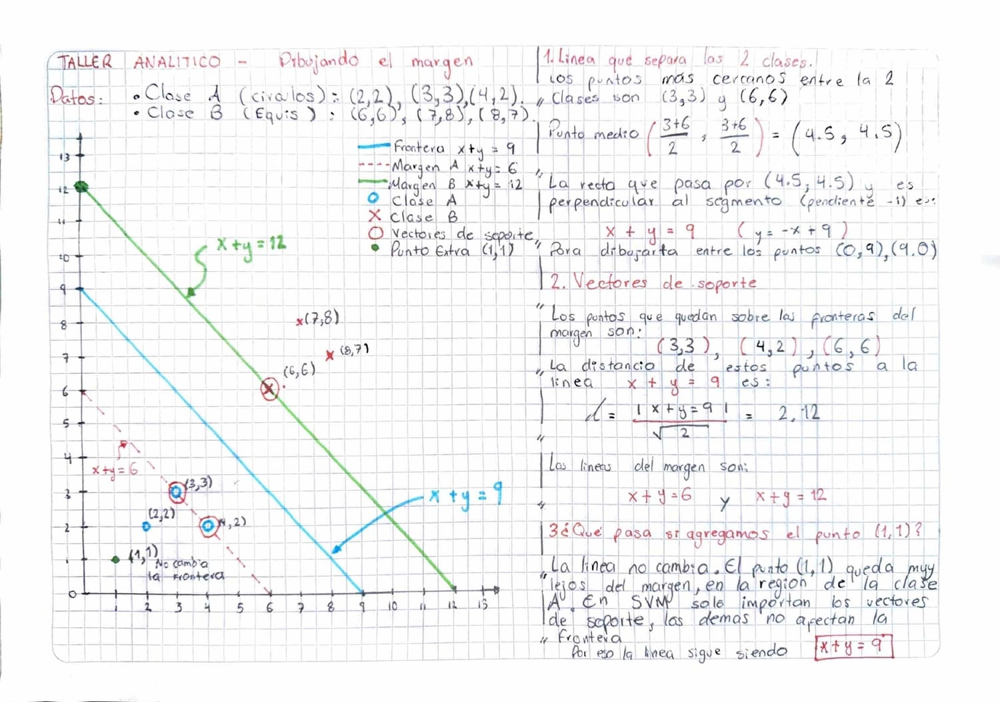
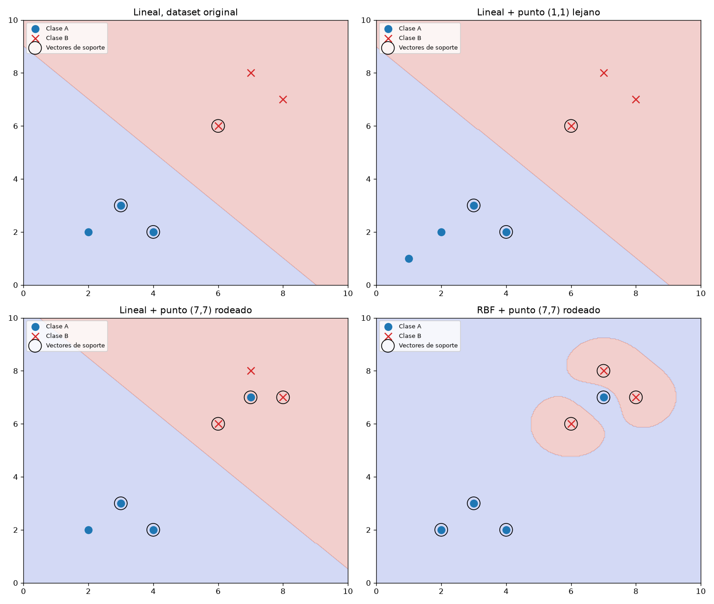

# Sesion 10 — SVM, maquinas de vectores de soporte

Hiperplano de maximo margen, vectores de soporte y el truco del kernel para
fronteras no lineales.

## Taller Analitico — Dibujando el margen



```
Clase A (circulos): (2,2), (3,3), (4,2)
Clase B (equis):    (6,6), (7,8), (8,7)
```

### Punto 1 — La linea optima

El margen maximo se apoya en los dos puntos mas cercanos entre las dos clases.
Comparando distancias, el par mas cercano es (3,3) y (6,6), que estan a
sqrt(18) = 4.24. La linea optima es la mediatriz de ese segmento: pasa por su
punto medio y es perpendicular a el.

```
Punto medio: ((3+6)/2, (3+6)/2) = (4.5, 4.5)
El segmento va en direccion (1,1), asi que la perpendicular tiene pendiente -1
Frontera: x + y = 9    (y = -x + 9)
```

Para dibujarla se unen los puntos (0,9) y (9,0).

### Punto 2 — Vectores de soporte

Con la distancia de un punto a una recta, `d = |x + y - 9| / sqrt(2)`:

| Punto | Clase | Distancia |
|---|---|---|
| (2,2) | A | 3.54 |
| (3,3) | A | 2.12 |
| (4,2) | A | 2.12 |
| (6,6) | B | 2.12 |
| (7,8) | B | 4.24 |
| (8,7) | B | 4.24 |

Los vectores de soporte son **(3,3), (4,2) y (6,6)**, los tres que estan a 2.12
de la frontera. Las lineas del margen son `x + y = 6` y `x + y = 12`, y la
comprobacion es directa: 3+3 y 4+2 dan 6, y 6+6 da 12. Los tres puntos estan
sobre las lineas del margen, no cerca de ellas.

### Punto 3 — Agregar el punto (1,1)

La frontera no cambia. El punto (1,1) da `x + y = 2`, muy por debajo del 6 que
marca el borde del margen, asi que queda en el fondo del territorio de la clase A.

SVM solo depende de los vectores de soporte: los puntos que no tocan el margen
tienen coeficiente cero en la solucion y no participan en definir donde va la
linea. Se podrian agregar cien puntos de clase A en esa esquina y la frontera
seguiria igual.

El contraste con KNN de la sesion anterior es directo. En KNN cada punto nuevo
puede alterar una votacion, porque el modelo memoriza todo el dataset. En SVM un
punto que no esta en el margen es invisible para el modelo, que solo guarda la
ecuacion del hiperplano. Por eso SVM entrena caro y predice barato, y KNN al
reves.

## Taller de Laboratorio — Fronteras no lineales

`lab10_svm_fronteras.py`



### El modelo reproduce el taller analitico

```
Lineal, dataset original
  aciertos: 6/6   frontera: x + 1.00y = 9.00
  vectores de soporte: [[3, 3], [4, 2], [6, 6]]
```

La frontera que calculo scikit-learn es exactamente la que trace a mano, y los
tres vectores de soporte son los mismos que marque en el cuaderno.

### Comprobacion del punto (1,1)

```
Lineal + punto (1,1) lejano
  aciertos: 7/7   frontera: x + 1.00y = 9.01
  vectores de soporte: [[3, 3], [4, 2], [6, 6]]
```

La frontera pasa de 9.00 a 9.01 y los vectores de soporte son los mismos tres.
Esa centesima es ruido numerico del solver, no un desplazamiento real. Confirma
lo que respondi en el punto 3 del analitico.

### Por que no use el punto (5,5) que pide el enunciado

El taller dice que al agregar (5,5) a la clase A el kernel lineal "probablemente
fallara o se vera forzado". Lo probe y no falla: clasifica 7 de 7.

La razon es que los datos siguen siendo linealmente separables. Con (5,5) en la
clase A, el maximo `x + y` de esa clase es 10, y el minimo de la clase B es 12,
asi que cualquier recta entre esos dos valores los separa. El SVM simplemente
desplaza la frontera de `x + y = 9` a `x + y = 11`. No hay nada que el kernel
lineal no pueda hacer ahi.

Para que el kernel lineal falle de verdad, el punto tiene que quedar realmente
rodeado por la clase contraria. Por eso use **(7,7)**, que cae en medio de (6,6),
(7,8) y (8,7).

### El kernel lineal contra el RBF

```
Lineal + punto (7,7) rodeado
  aciertos: 6/7   frontera: x + 1.00y = 10.50

RBF + punto (7,7) rodeado
  aciertos: 7/7   frontera: curva (no lineal)
```

El lineal falla. En el panel se ve el punto azul de (7,7) dentro de la zona roja:
la recta se corrio hasta 10.50 tratando de acomodarlo y no lo consiguio. Ninguna
recta puede, porque para aislar un punto rodeado habria que curvarse.

El RBF llega a 7 de 7, y el panel muestra como: dibuja dos islas rojas cerradas
alrededor de los puntos de la clase B y deja (7,7) en territorio azul. Eso es el
truco del kernel. El algoritmo no curva la recta, sino que proyecta los puntos a
un espacio de mas dimensiones donde un hiperplano recto si los separa; lo que se
ve como curva en el plano es el corte de ese hiperplano al volver a dos
dimensiones.

Fije `gamma=1.0` en lugar de dejar el valor automatico. Con `gamma="scale"` el
RBF tambien falla en este caso, 6 de 7. El gamma controla que tan cerrada es la
region de influencia de cada punto, y el heuristico automatico queda demasiado
suave para un dataset de siete puntos. El kernel trick funciona, pero hay que
calibrar el hiperparametro.

Un detalle del panel del RBF: casi todos los puntos terminan siendo vectores de
soporte, 7 de 7. Con tan pocos datos y un gamma alto, el modelo necesita
practicamente todo el dataset para sostener una frontera tan contorsionada. Es
una señal temprana de sobreajuste.

### Reflexion — Cuando se necesita RBF

Un kernel lineal falla cuando las clases no se pueden separar con una recta, y
eso pasa siempre que una clase rodea a la otra o se entrelaza con ella.

En medicina, un rango biologico saludable suele estar en el medio: presion,
glucosa o temperatura son peligrosas tanto por debajo como por encima del rango
normal. Si se grafican pacientes sanos contra pacientes en riesgo usando dos de
esas variables, los sanos quedan en una isla central rodeada por los casos
criticos en todas direcciones. Ninguna recta puede aislar el centro de la
periferia, pero una frontera cerrada si.

En reconocimiento facial pasa algo parecido: la misma cara bajo distintas
iluminaciones o angulos genera puntos dispersos en el espacio de
caracteristicas, y esos grupos se intercalan con los de otras personas en vez de
quedar en mitades limpias.

La condicion es geometrica, no de dominio: si una clase esta rodeada por la otra,
el kernel lineal no alcanza.