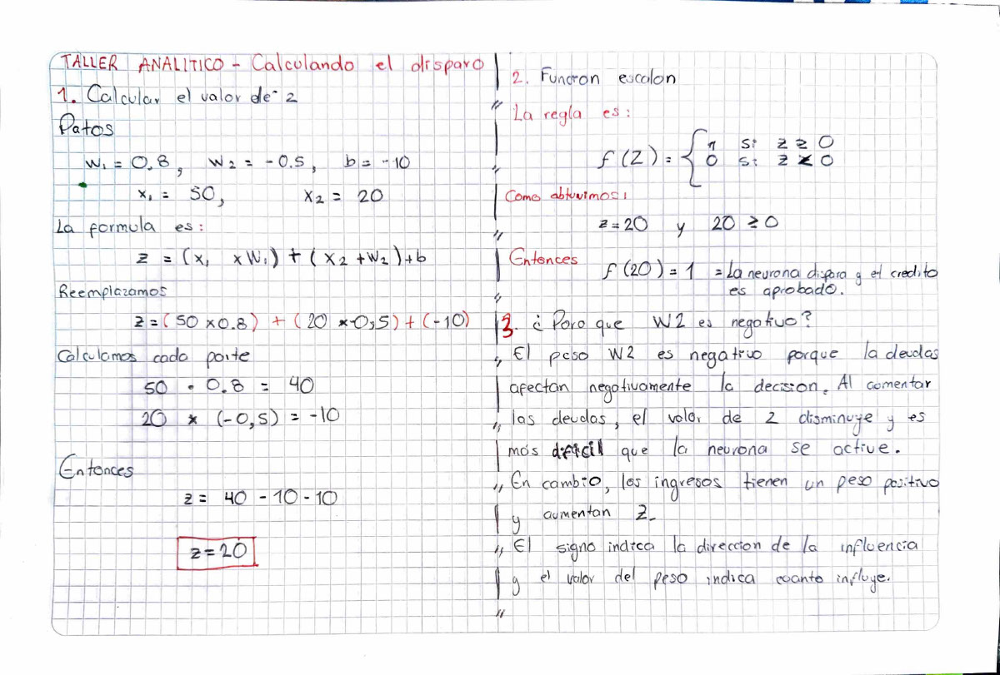

# Sesion 11 — Redes neuronales: el Perceptron

En esta sesion arrancamos con redes neuronales. El perceptron es la neurona mas
simple que existe: recibe unos datos, los multiplica por unos pesos, les suma un
sesgo y decide si "dispara" o no. Lo programe desde cero, sin librerias de IA.

## Taller Analitico — Calculando el disparo



El ejercicio era un perceptron que decide si aprobar un credito mirando los
ingresos y las deudas de un cliente.

```
Pesos:   W1 = 0.8 (ingresos),  W2 = -0.5 (deudas)
Sesgo:   b = -10
Cliente: ingresos 50, deudas 20
```

### Punto 1

Multiplique cada entrada por su peso y le sume el sesgo:

```
Z = (50 * 0.8) + (20 * -0.5) + (-10)
Z = 40 - 10 - 10
Z = 20
```

### Punto 2

La funcion escalon es sencilla: si Z da cero o mas, la neurona dispara un 1; si
da negativo, un 0. Como me dio 20, la neurona dispara y **el credito se aprueba**.

Para comprobar que no le aprueba a todo el mundo, probe con un cliente que gana
10 y debe lo mismo: da -12, asi que a ese lo rechaza.

### Punto 3

W2 es negativo porque las deudas juegan en contra. Cada peso le dice a la neurona
si una variable ayuda o estorba: los ingresos suben el valor de Z y las deudas lo
bajan. Mientras mas deba el cliente, mas dificil es que la neurona se active. Si
el peso de las deudas fuera positivo, el banco le aprobaria mas facil el credito
a quien mas debe, que no tiene sentido.

Tambien me parecio interesante que el sesgo funciona como el nivel de exigencia
del banco. Si lo bajo a -30, el banco se vuelve mas estricto sin tocar ningun
peso.

## Taller de Laboratorio — Hackeando los pesos

`lab11_perceptron.py`

Segui la estructura de la guia: una funcion para la neurona y otra para la
activacion escalon. Por dentro no hay nada magico, es un producto punto de NumPy
y un `if`.

### Primero verifique la compuerta AND

```
Compuerta AND  (pesos = [0.5 0.5], sesgo = -0.8)
  [0, 0] -> 0
  [0, 1] -> 0
  [1, 0] -> 0
  [1, 1] -> 1
```

Funciona: solo dispara cuando las dos entradas son 1.

### Despues resolvi la compuerta OR

```
Compuerta OR  (pesos = [0.5 0.5], sesgo = -0.2)
  [0, 0] -> 0
  [0, 1] -> 1
  [1, 0] -> 1
  [1, 1] -> 1
```

Lo curioso es que no tuve que cambiar los pesos, solo el sesgo. Con pesos de 0.5
cada entrada activa suma medio punto:

| Entradas | Suma | AND (sesgo -0.8) | OR (sesgo -0.2) |
|---|---|---|---|
| [0, 0] | 0.0 | no dispara | no dispara |
| [0, 1] | 0.5 | no dispara | dispara |
| [1, 0] | 0.5 | no dispara | dispara |
| [1, 1] | 1.0 | dispara | dispara |

Lo entendi asi: el sesgo es la barra que hay que superar para disparar. En el AND
la puse alta, entonces solo pasa cuando las dos entradas estan activas. En el OR
la baje, entonces con una sola basta. Es la misma idea del sesgo del credito.

Tampoco es que -0.2 sea el unico valor que sirve. Cualquier sesgo entre -0.5 y 0
resuelve el OR, porque tiene que ser negativo para que [0, 0] no dispare, pero no
tan negativo como para que una sola entrada no alcance.

Lo que hice a mano, ir probando valores hasta que la neurona responda bien en
todos los casos, es justo lo que una red neuronal hace sola cuando se entrena.

### Lo que no se puede hacer con una sola neurona

Me quede pensando en la compuerta XOR, que dispara con [0, 1] y [1, 0] pero no
con [1, 1]. Por mas que se muevan los pesos, un perceptron solo no la resuelve.
La razon es la misma que vimos con SVM: una neurona sola traza una linea recta, y
los casos del XOR no se pueden separar con una recta. Para eso hay que juntar
varias neuronas en capas.