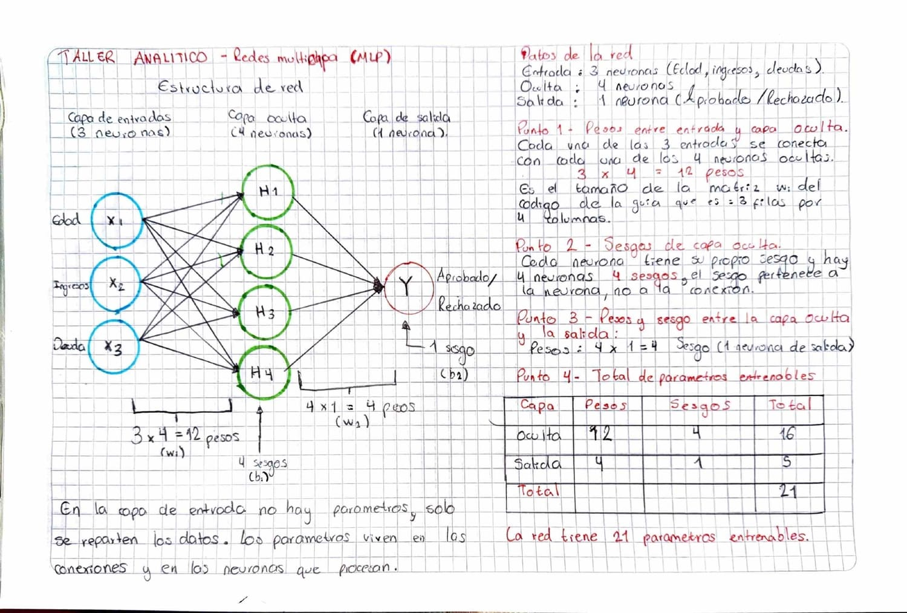

# Sesion 12 — Redes neuronales multicapa (MLP)

En la sesion anterior vi que una sola neurona no puede resolver el XOR, porque
solo sabe trazar una linea recta. La solucion es juntar varias neuronas en capas.
Eso es una red multicapa: una capa de entrada, una o mas capas ocultas que
descubren patrones, y una capa de salida que da la respuesta.

## Taller Analitico — Contando parametros



La red era para aprobar tarjetas de credito:

```
Entrada:  3 neuronas (edad, ingresos, deuda)
Oculta:   4 neuronas
Salida:   1 neurona (aprobado o rechazado)
```

La clave para contar es que en una red densa cada neurona se conecta con todas
las de la capa siguiente. Por eso los pesos entre dos capas salen de multiplicar.

### Punto 1

Cada una de las 3 entradas va a cada una de las 4 neuronas ocultas, asi que hay
**3 x 4 = 12 pesos**. Es justo el tamaño de la matriz W1 del codigo, 3 filas por
4 columnas.

### Punto 2

Cada neurona oculta tiene su propio sesgo, asi que son **4 sesgos**. El sesgo es
de la neurona, no de la flecha, por eso se cuenta por neurona.

### Punto 3

De la capa oculta a la salida hay **4 x 1 = 4 pesos**, y la neurona de salida
tiene **1 sesgo**.

### Punto 4

| Capa | Pesos | Sesgos | Total |
|---|---|---|---|
| Oculta | 12 | 4 | 16 |
| Salida | 4 | 1 | 5 |
| **Total** | | | **21** |

La red tiene **21 parametros entrenables**.

Hay un atajo para cualquier capa: `(entradas + 1) x neuronas`. El +1 es el sesgo,
que funciona como una entrada extra que siempre vale 1. Da lo mismo:
(3+1) x 4 = 16 y (4+1) x 1 = 5.

La capa de entrada no tiene parametros porque no calcula nada, solo reparte los
datos.

## Taller de Laboratorio — Explorando las matrices

`lab12_mlp_forward.py`

Copie la red de la guia y meti la propagacion en una funcion, para poder correrla
con uno o con varios clientes sin repetir codigo.

### Un cliente

```
Z1 (valores puros):  [-0.07  0.36  0.75 -0.78]
A1 (tras sigmoide):  [0.4825 0.589  0.6792 0.3143]
Probabilidad:        [0.6259]
```

La red le da un 62.59% de probabilidad de aprobacion.

Lo interesante es ver que hizo la sigmoide con Z1. Los valores negativos
quedaron por debajo de 0.5 y los positivos por encima: el -0.78 bajo a 0.31 y el
0.75 subio a 0.68. El cero es el punto de equilibrio, porque la sigmoide de 0 da
exactamente 0.5. No cambia el orden de los valores, solo los aplasta entre 0 y 1
para que se puedan leer como probabilidades.

### Dos clientes al mismo tiempo

```
Forma de X:   (2, 3)
Forma de Z1:  (2, 4)
Probabilidades: [0.6259 0.6539]
```

Solo cambie X por una matriz de 2x3, y sin tocar ningun peso la red calculo los
dos clientes de una vez. Al multiplicar la matriz de 2x3 por W1, que es de 3x4,
sale una de 2x4: una fila de resultados por cliente.

Lo que me convencio de que funciona es que el primer cliente dio 0.6259, lo mismo
que cuando lo procese solo. El lote no mezcla a los clientes, cada fila se
calcula por su lado, solo que todas al mismo tiempo. Con mil clientes seria la
misma linea de codigo, y por eso las GPU aceleran tanto el deep learning: estan
hechas para multiplicar matrices grandes de una sola vez.

### Por que sigmoide y no escalon

En la sesion 11 use la funcion escalon, que solo responde 0 o 1. La sigmoide da
un valor intermedio que dice que tan segura esta la red: 0.6259 es un
"probablemente si", no un si rotundo. Ademas es suave, y eso es lo que va a
permitir entrenar la red, porque el escalon es plano y no da una pendiente que
seguir para ajustar los pesos.